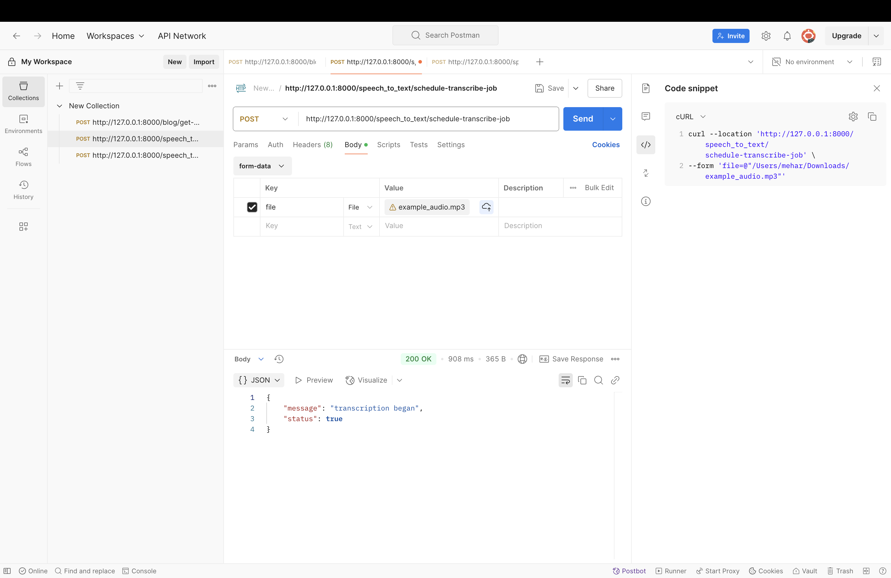
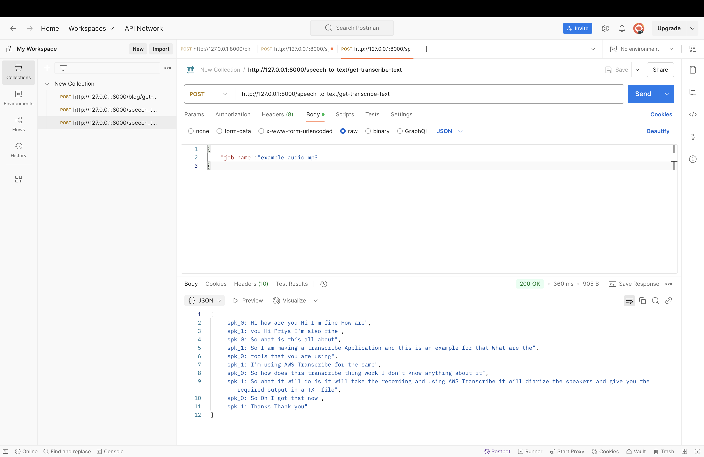
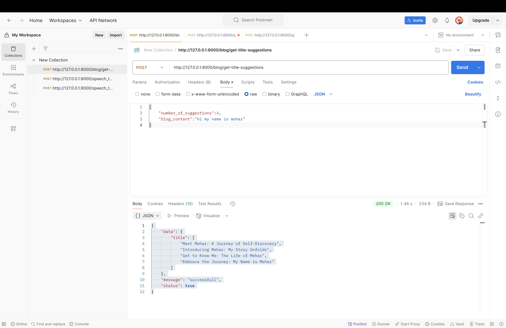
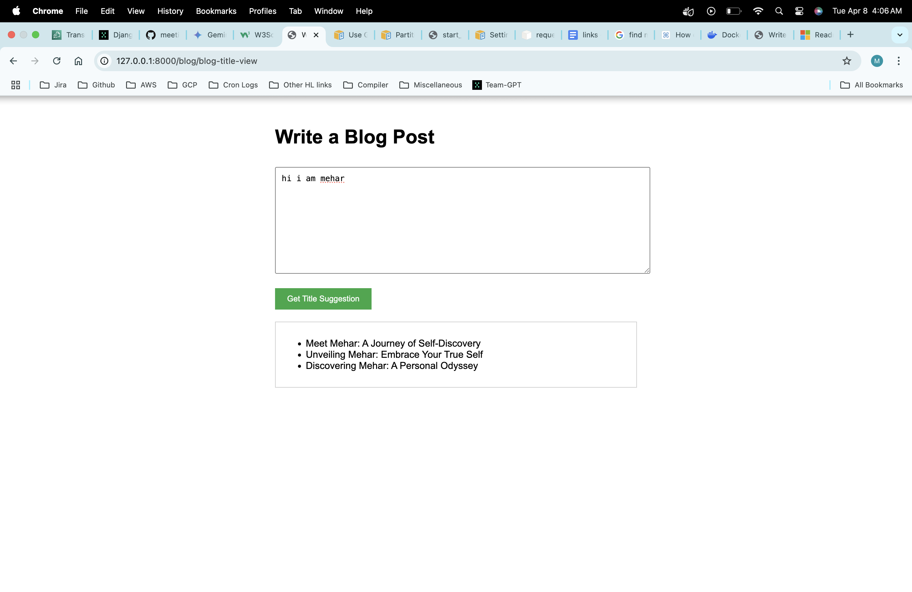

# Gen AI Django Project

This project implements two main features: audio transcription with speaker diarization and AI-generated title suggestions for blog posts. The project is containerized using Docker and leverages AWS services for transcription and a natural language processing model for title suggestions.

## Features

### Feature 1: Audio Transcription with Diarization

* Transcribes audio files with speaker diarization, identifying "who spoke when".
* Returns transcription results in a structured JSON format.

### Feature 2: Blog Post Title Suggestions

* Uses NLP to generate three potential title suggestions for a given blog post content.
* Provides a Django endpoint to accept blog post content and return title suggestions in JSON format.

## Setup Instructions

### Prerequisites

* Install [Docker](https://www.docker.com/) and ensure it's running on your system.
* Have an AWS account with access to S3 and Transcribe services.
* Configure your AWS credentials.
* Have an OpenAI API Key

### Installation

1.  **Clone the Repository**

    ```bash
    git clone [https://github.com/mehargirdhar/django_app.git](https://github.com/yourusername/gen_ai.git)
    cd django_app
    ```

2.  **Configure Environment Variables**

    * Create a `.env` file in the project root with the following variables (rename .env.example):

        ```ini
        OPENAI_API_KEY=your openai api key
        AWS_ACCESS_KEY_ID=your_access_key_id
        AWS_SECRET_ACCESS_KEY=your_secret_access_key
        AWS_REGION_NAME=your_region
        AWS_S3_BUCKET_NAME=your_s3_bucket_name
        AWS_S3_BUCKET_TEMP_KEY=temporary folder name for saving audio files in s3
        ```

3.  **Build and Run with Docker**

    * To build and run the application using Docker, execute:

        ```bash
        docker build -t django:1 .
        docker run -p 8000:8000 django:1 &
        ```


### Running the Application

* The Django application will be accessible at `http://localhost:8000`.

## API Endpoints

### Audio Transcription with Diarization

**Schedule Transcription Job**

* **URL:** `http://127.0.0.1:8000/speech_to_text/schedule-transcribe-job`
* **Method:** `POST`
* **Body:** form-data (key - file, type- File, value- < MP3 File >)
* **Description:** Uploads an MP3 file, starts an AWS Transcribe job for transcription with speaker diarization.
* **Response:**

    ```json
    {
      "message": "File uploaded and transcription job started",
      "status": true
    }
    ```
* **Example Output:**


**Get Transcribed Text**

* **URL:** `http://127.0.0.1:8000/speech_to_text/get-transcribe-text`
* **Method:** `POST`
* **Body:**
    ```json
    {
        "job_name":"example_audio.mp3"
    }
    ```
* **Description:** Fetches the transcription text once the job is complete.
* **Response:**

    ```json
    {
      "transcription": ["Speaker 1: ... Speaker 2: ..."]
    }
    ```
* **Example Output:**


### Blog Post Title Suggestions

**Get Title Suggestions**

* **URL:** `http://127.0.0.1:8000/blog/get-title-suggestions`
* **Method:** `POST`
* **Body:**

    ```json
    {
        "number_of_suggestions":4,
        "blog_content":"hi my name is mehar....."
    }
    ```

* **Description:** Accepts blog post content and returns mentioned AI-generated title suggestions.
* **Response:**

    ```json
    {
        "data": {
            "title": [
                "Meet Mehar: A Journey of Self-Discovery",
                "Introducing Mehar: My Story Unfolds",
                "Get to Know Me: The Life of Mehar",
                "Embrace the Journey: My Name is Mehar"
            ]
        },
        "message": "successfull",
        "status": true
    }
    ```
* **Example Output:**


**Sample Title Suggestions View**
* **URL:** `http://127.0.0.1:8000/blog/blog-title-view`
* **Example Output:**



